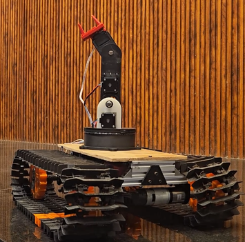
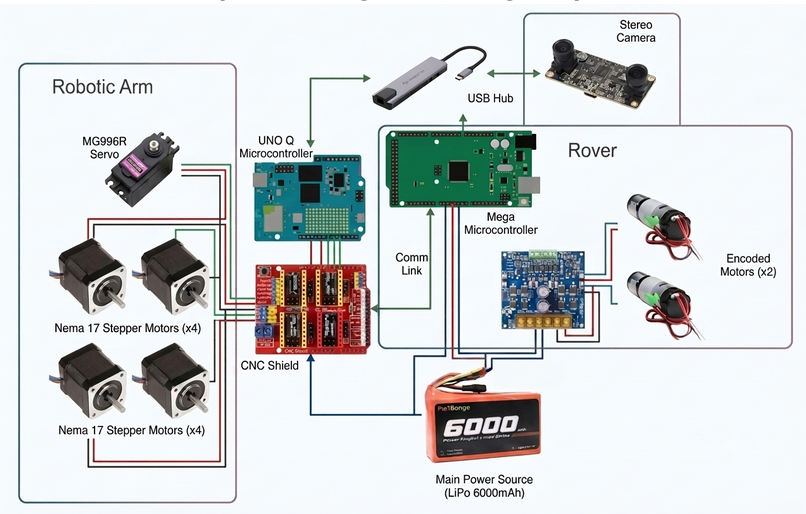
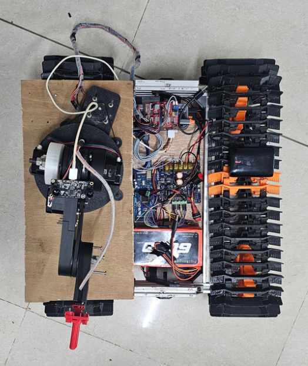
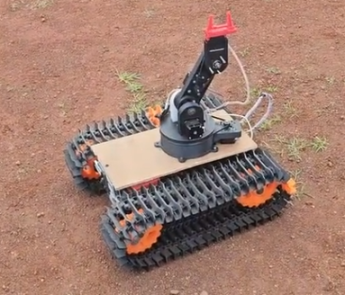
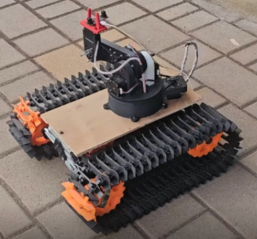
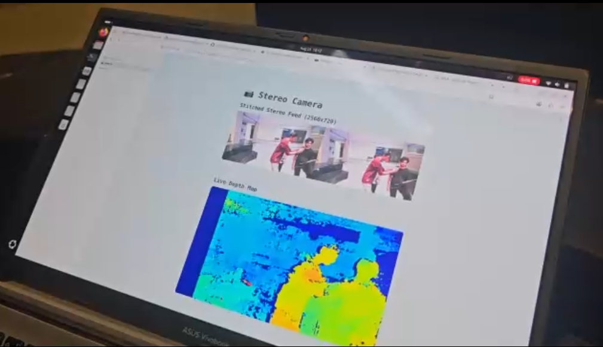
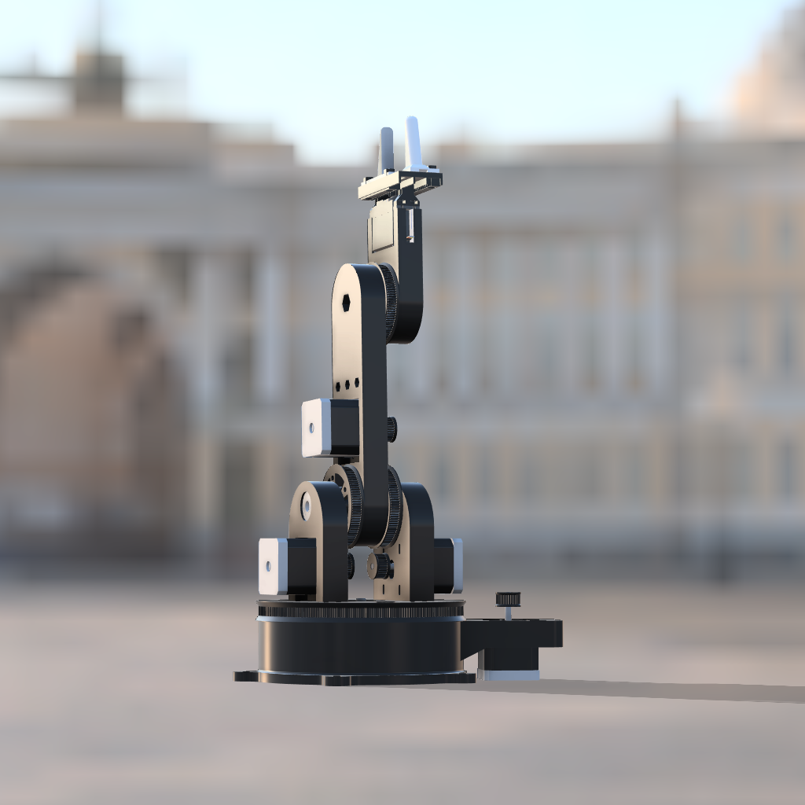
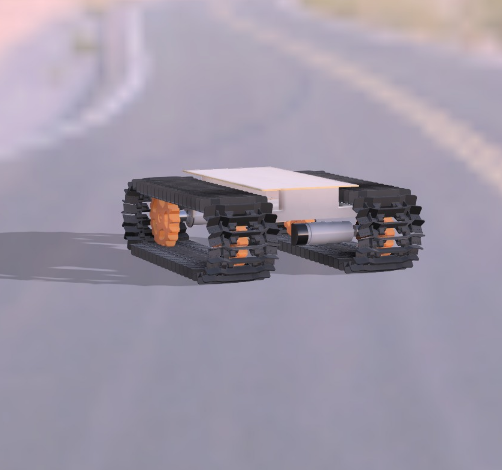
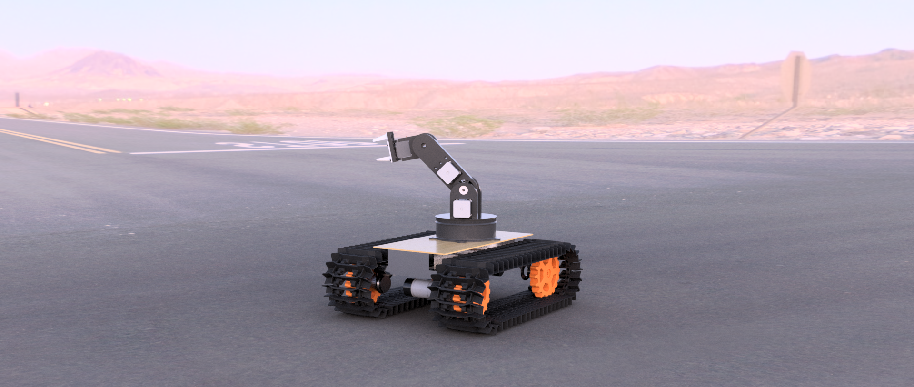

  

# All Terrain Rover

Traversing rugged, unstructured terrain — agricultural fields, mining sites, hazardous exploration zones — while performing precise manipulation tasks is difficult for wheeled robots and manual human intervention alike. Field workers, disaster-response teams, and inspection personnel often need a platform that can navigate uneven ground and interact with objects (spraying, sorting, sampling) without putting a person in the risk zone.

## How It Works

The All Terrain Rover is an Unmanned Ground Vehicle (UGV) built for navigating rough terrain while performing precise manipulation tasks. It uses a track-based locomotion system on an aluminum chassis with 3D-printed tracks, giving it smoother impact absorption and stability across uneven ground compared to wheeled platforms.

Mounted on top is a 4-DOF robotic arm, actuated by NEMA17 stepper motors and an MG996R servo through a CNC shield, capable of high-precision positional movement for tasks like object sorting, targeted spraying, and sampling.

The system is controlled through a local web dashboard hosted on the Arduino UNO Q, which streams a live video feed from an onboard stereo AR0144 camera and lets an operator teleoperate both the rover and the arm in real time. The UNO Q acts as the central brain — directly driving the arm and handling vision — while an Arduino Mega runs dedicated locomotion firmware for the tracks, executing movement commands sent from the UNO Q.

## Bill of Materials

| Component | Qty |
|---|---|
| Aluminium frames | 4 |
| Bambu Lab PLA Basic — Black, 1.75mm | 3 |
| Bambu Lab PLA Basic — Orange, 1.75mm | 1 |
| Arduino UNO Q (4GB, ABX00173) | 1 |
| Arduino Mega 2560 (ATmega2560, Rev3, A000067) | 1 |
| IG45 Industrial Grade Planetary DC Geared Encoder Servo Motor | 2 |
| Rhino MDD20A Dual DC Motor Driver (2-channel, 6–30V) | 1 |
| NEMA17 stepper motor | 4 |
| MG996R 180° servo motor | 1 |
| A4988 stepper motor driver | 4 |
| CNC shield | 1 |
| Pro-Range IFR 32650 12.8V 6000mAh 3C 4S1P LiFePO4 battery pack | 1 |
| Portronics MPort View Three 10-in-1 USB-C dock (100W PD, 4K HDMI, VGA, RJ45, SD/TF, USB 3.0/2.0, 3.5mm audio) | 1 |
| AR0144 2MP stereo USB camera module (USB2.0, synchronized same-frame output, 52mm baseline, distortion-free lenses) | 1 |

## System Architecture & Circuit

### Signal Flow

Rover motors → Arduino Mega
Arduino Mega → UNO Q (via USB hub, serial)
Robotic arm motors → CNC shield (mounted on UNO Q)
Stereo camera → USB hub → UNO Q

### UNO Q:

drives the arm directly
talks to the Mega serially for rover control
processes the onboard stereo depth feed
hosts the control dashboard over Streamlit

### Block Diagram & Circuit Schematic

  

  

## Code Structure

- **`setup()`** — initializes the NEMA17 motors and the MG996R servo responsible for arm control
- **OpenCV** — accesses the camera and streams the feed to the web dashboard
- **`loop()`** — continuously drives the NEMA17 motors
- **pyserial** — talks to the Arduino Mega and sends rover movement commands
- **Mega firmware** — runs dedicated rover locomotion control code

## Demo Video

[Watch on Google Drive](https://drive.google.com/file/d/10mO3DqsJaEezeDgVusVye5emnCNlNR8r/view?usp=drive_link)

## Testing & Results

The stack combines several subsystems that needed to work together, so each was built and tested independently first: the robotic arm and the rover base. Both were tricky to get right.

Low-level testing was done directly through the Arduino IDE Serial Monitor before integrating each subsystem into the Python control layer and bridging it into the web UI. The UI itself was comparatively straightforward to build and configure. Camera and full-system compatibility were verified through individual component testing before final integration.

The result is a complete rover stack — robotic arm plus stereo camera with local depth estimation — offering high-level teleoperated control over the web, usable on both mobile and desktop.

### Project Images

  

  

  

### Demo Videos

  <video src="assests/gifs/gripper.mp4" width="400" height="400" controls loop muted autoplay></video>

  <video src="assests/gifs/depth_cam.mp4" width="400" height="400" controls loop muted autoplay></video>

  <video src="assests/gifs/demo.mp4" width="400" height="400" controls loop muted autoplay></video>

  <video src="assests/gifs/rover.mp4" width="400" height="400" controls loop muted autoplay></video>

  <video src="assets/gifs/v2.mp4" width="400" height="400" controls loop muted autoplay></video>

### 3D Model / Render

  

  

  

## Challenges, Learnings & Future Improvements

### Challenges Faced

The biggest challenge was assembling the complete structure without hardware failure. The track system adds mechanical complexity but is rigid enough to withstand heavy loads. Integrating the stereo camera for depth feedback was also tricky — finding a configuration where the UNO Q could sustain the load of running the rest of the stack while also computing depth maps (a much heavier workload) took real tuning; the UNO Q handles it with some lag but holds up.

We also ran into trouble wiring the MG996R servo to the CNC shield. Even though the board provides 5V and ground, running jumper wires from the arm to the CNC board over that distance introduced enough resistance to cause problems.

### What We Learned & What's Next

Working with the UNO Q — and using Bricks to develop faster — was a great experience and sped up a lot of the build. Looking ahead, we want to make the project ROS-compatible and fully autonomous, so the rover can navigate on its own.

## :star2: Inspirational Sources

Gratitude to the open-source repositories that inspired this project — well worth exploring for further learning:

- [articubot_one](https://github.com/joshnewans/articubot_one)
- [diffbot](https://github.com/ros-mobile-robots/diffbot)
- [noah_hardware](https://github.com/GonzaCerv/noah-hardware)
- [linorobot](https://github.com/linorobot/linorobot2)

## :raised_hands: Contributing

Issues or PRs are always welcome!