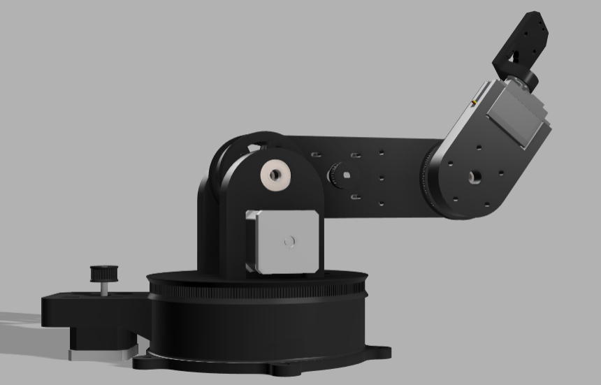

# 🤖 RoboticArm

A **3D-printed robotic arm** powered by an **Arduino UNO Q**, **CNC Shield**, four stepper motors, and an additional servo motor for end-effector control.

The project combines embedded motor control with a **Streamlit-based web interface**, allowing the robotic arm to be controlled through a simple and intuitive UI.

---

## 📸 Project

<!-- ### Real-Life Build

 -->

### 3D Model / Render



---

## 🦾 Overview

The robotic arm is a **3D-printed multi-axis robotic manipulator** designed around the **Arduino UNO Q**.

The main joints are driven using **four stepper motors**, with each motor responsible for controlling a major movement axis of the arm.

An additional **servo motor** is used to operate the end effector/gripper.

### Main Features

- 🧠 **Arduino UNO Q** as the main controller
- ⚙️ **4 stepper motors** for major joint movements
- 🔩 **CNC Shield** for stepper motor control
- 🦾 **Servo motor** for end-effector control
- 🌐 **Streamlit web UI** for controlling the robotic arm
- 🖨️ **3D-printed mechanical structure**
- 🔌 Arduino RouterBridge communication
- 🎛️ Software-based joint control

---

## 🌐 Web Control Interface

A **Streamlit-based web UI** is used to provide a simple interface for operating the robotic arm.

The interface provides control over:

- Base rotation
- Shoulder movement
- Elbow movement
- Wrist movement
- End-effector operation
- Motor movement parameters

The goal is to make the robotic arm easier to operate without requiring direct interaction with the Arduino serial interface.

---

## 🚀 Getting Started

### 1. Clone the Repository

```bash
git clone https://github.com/attu0/UnoQRoboticArm.git
cd UnoQRoboticArm
```

### 2. Upload the Arduino Code

Open the Arduino project and upload the motor-control firmware to the **Arduino UNO Q**.

Make sure the CNC Shield and stepper motors are connected correctly before powering the system.

### 3. Install Python Dependencies

Install the required Python packages:

```bash
pip install streamlit
```

Additional dependencies may be required depending on the current implementation.

### 4. Start the Web Interface

Run:

```bash
streamlit run app.py
```

The Streamlit interface can then be opened in a web browser.

---


## 🧰 Technologies Used

### Hardware

- Arduino UNO Q
- CNC Shield
- Stepper Motors
- Servo Motor
- 3D-printed robotic arm

### Embedded / Control

- Arduino
- `CNCShield`
- `AccelStepper`
- `Arduino_RouterBridge`

### Python / Web

- Python
- Streamlit
- `arduino.app_bricks.streamlit_ui`
- `arduino.app_utils`

---

## 🔮 Future Improvements

The project can be extended with more advanced robotic functionality:

- 🧮 **Inverse Kinematics**
- 📐 Forward Kinematics
- 🎯 Point-to-point positioning
- 🦾 Coordinated joint movements
- 💾 Save and load robotic arm poses
- 🎮 Joystick/gamepad control
- 🛑 Software safety limits
- ⚡ Acceleration and velocity profiles
- 📊 Real-time joint status
- 🤖 ROS 2 integration
- 📷 Computer vision-based object detection
- 📦 Pick-and-place automation

---


## 👨‍💻 Author

**Atharv Mudse**

---

⭐ If you find this project interesting, consider giving the repository a star!